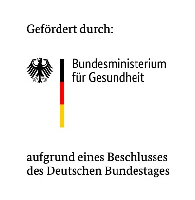

A major milestone for us: We have been awarded €2.3 million in funding from the Federal Ministry of Health (BMG) for the SynoSys.PC project, aimed at advancing the understanding of Long-COVID and advancing patient care.

By harnessing high-resolution wearable data and applying methods from network science, data analytics and AI, SynoSys, in collaboration with the University Hospital Jena, seeks to develop innovative approaches and gain significant insights to the underlying mechanisms of Long-Covid and Post-Covid-Condition (PCC).

The project builds on one of the largest datasets of its kind, with high-resolution individual time series of wearable data, e.g. heart rate, physical activity and sleep from more than 500,000 participants. Key goals include identifying wearable-based indicators of persistent symptoms and establishing an open competence center to drive the integration of digital technologies into health research and care.

This project represents a significant leap toward leveraging digital health tools and smart technologies for public health. SynoSys is proud to be at the forefront of shaping the future of healthcare and we are super excited to start pushing the envelope in this area.

