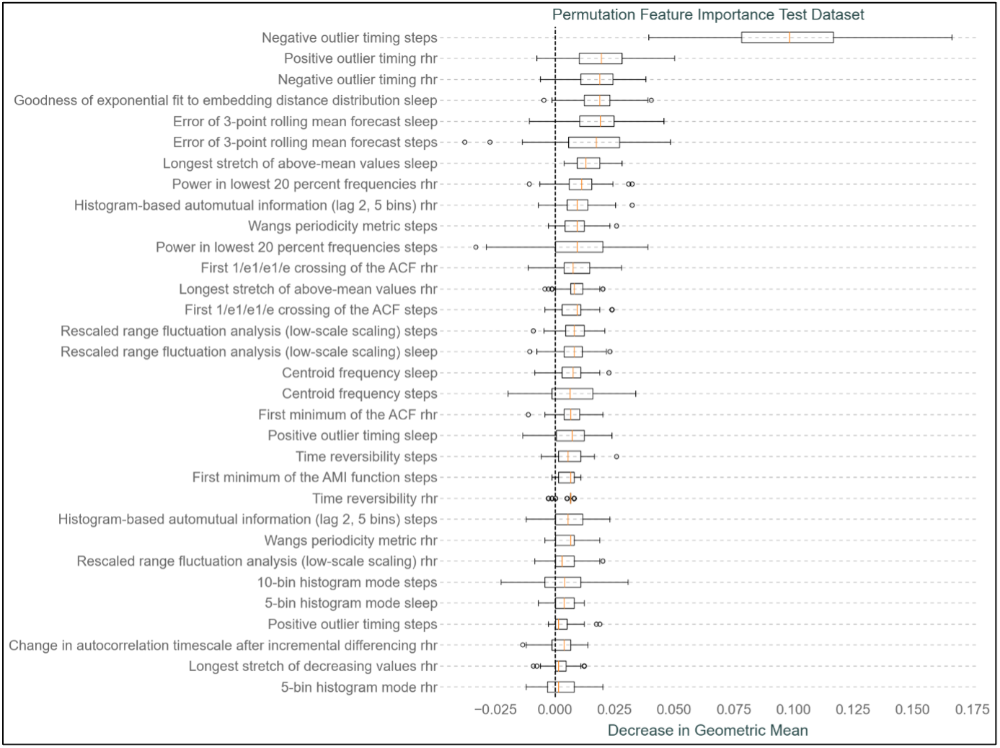
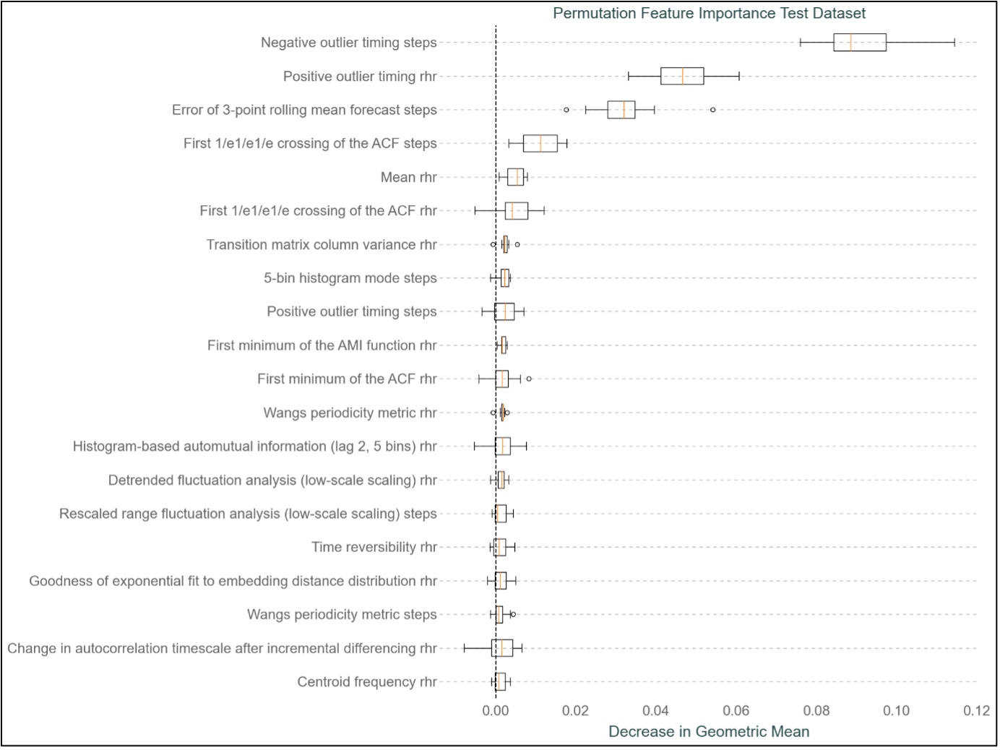

Controlling the spread of infectious diseases early in a pandemic is crucial. The recent COVID-19 outbreak and its rapid global spread highlight the urgent need for tools that can limit the spreading of infectious diseases at the earliest stage possible to prevent global pandemics.
Previous research has suggested the potential to detect COVID-19 infections through the observation of physiological alterations occurring after the onset of the disease, including elevated resting heart rates, extended sleep durations, and decreased physical activity. Wearable sensors, equipped to monitor these changes, in conjunction with machine learning algorithms trained on data from these sensors, could identify these variations, thus providing a method to quickly classify individuals as infected.
Utilizing wearable sensor data from the Corona Data Donation Project, which encompasses resting heart rate, step count, and sleep duration time series from over 120,000 voluntary participants, a Logistic Regression model was developed for the classification of submitted COVID-19 test results. This model achieved classification success, as evidenced by a Receiver Operating Characteristic Area Under the Curve (ROC AUC) of 0.58, precision of 0.26, and recall of 0.54. The implementation of the catch22 feature set for feature extraction from the submitted wearable sensor data enhanced the interpretability of the classification algorithm. It also enables a more detailed analysis of the specific physiological changes used to differentiate individuals testing positive or negative for COVID-19.
This study emphasizes the capability of predicting COVID-19 across large cohorts and underscores the value of employing infectious disease prediction models based on wearable sensor data as an additional public health tool.
**The LR model presented in Fig. 1 demonstrated** prediction capabilities for COVID-19 test results surpassing random chance, thereby facilitating the early detection of this infectious disease. Additionally, the incorporation of catch22 features into the feature engineering process enhanced the interpretability of the classification decisions made by the model.
The predictive LR model shown in Fig. 1 demonstrated satisfactory performance, notable given the voluntary nature of data submission, the impossibility of verifying correct and constant wear of devices, reliance on daily averages, absence of precise test and symptom onset dates, and the utilization of multiple devices across a broad cohort. The present study introduced a predictive model that has been trained on a considerable cohort size, addressing concerns from existing research about models only trained on significantly smaller cohorts. Additionally, this study tackled the issue of geographic underrepresentation by developing a predictive model for COVID-19 classification with data donated outside the United States, addressing other concerns in existing literature.
Additionally confirmatory models have been developed which showed performances consistent with existing literature, validating its efficacy in confirming COVID-19 infections within this study’s framework. Enhancements in confirmatory capability were noted with the increasing days included after a COVID-19 test submission, indicating that a longer observational period bolsters the model’s confirmatory power. Employing interpretable catch22 feature engineering provided clarity in the classification process and verified that the detected signals coincide with physiological responses to COVID-19 infection, as shown in Fig. 2 and 3. This consistency in signal detection across the models and their alignment with other research accentuates the catch22 features’ ability to accurately capture vital data signals from wearable sensor data. Conclusively, this study proposes a combined approach of catch22 feature engineering and machine learning classification algorithms as an effective strategy in combating the rapid spread of infectious diseases. Highlighting that this methodology could be particulary valuable in the initial stages of a pandemic, where traditional methods might be unavailable. Thus, it offers an essential addition to public health resources. This study stresses the potential of utilizing wearable sensor data, combined with automated feature engineering and machine learning classification algorithms, for the detection and confirmation of diseases like COVID-19. With additional advancements machine learning approaches to detect illnesses like COVID-19 using wearable sensor data could significantly improve the readiness and response to future public health crise

 <figure>
  
  <figcaption>
  Fig. 2 - Permutation Feature Importance for the test dataset for the Confirmatory LR: Focusing on features that led to a mean increase in model performance (increase in Geometric Mean (GM)). This represents a selection from the complete set of features. Each box displayed on the dashed line in the plot illustrates the range from the first to the third quartile of the GM reduction observed over 100 iterations for each catch22 feature. The median reduction in GM is denoted by the orange line within each box. The whiskers extend to the most extreme GM reduction value that falls within 1.5 times the interquartile range from the edges of the box. Any outliers are represented by dots.
</figcaption>
</figure>

 <figure>
  
  <figcaption>
  Fig. 3 - Permutation Feature Importance for the test dataset for the Confirmatory XGBoost Model: Focusing on features that led to a mean increase in model performance (increase in Geometric Mean (GM)). This represents a selection from the complete set of features. Each box displayed on the dashed line in the plot illustrates the range from the first to the third quartile of the GM reduction observed over 100 iterations for each catch22 feature. The median reduction in GM is denoted by the orange line within each box. The whiskers extend to the most extreme GM reduction value that falls within 1.5 times the interquartile range from the edges of the box. Any outliers are represented by dots.
</figcaption>
</figure>
