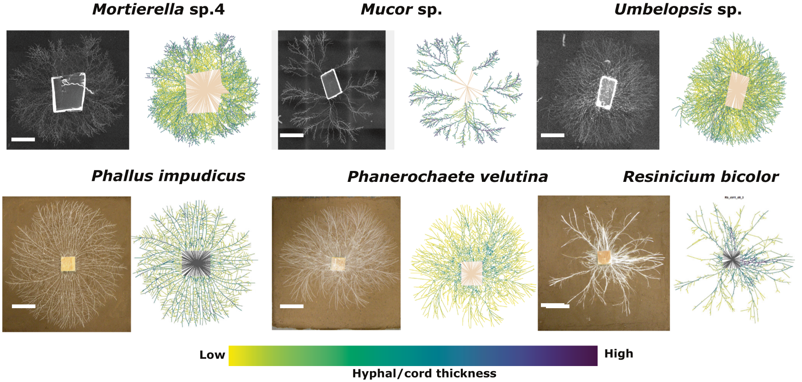
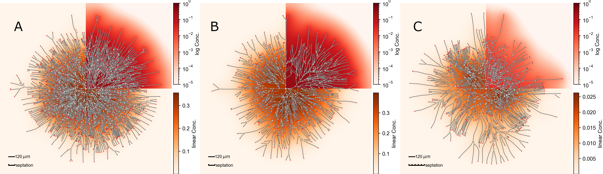

Fungi interact in a mycorrhizal symbiosis with plants or are simple decomposers of organic matter.
In this project, we investigate the growth of filamentous fungi by creating and investigating mathematical growth models.
We cooperate with experimental biologists from the [aguilar ecology lab](https://www.aguilar-ecology.com/) who have a profound knowledge of the growth patterns of different fungal species (see Fig.1).
In a first [network analysis of our collaborators](https://academic.oup.com/ismecommun/article/2/1/2/7460968), they identified that some network traits vary most in between species, as for example the meshedness (how different the network is from a fully-connected one without crossing edges).

<figure>
  
  <figcaption>Fig.1 - Different species of hyphal growing fungi and the reconstruction of the network they are forming.
  Figure is adapted from <a href="https://academic.oup.com/ismecommun/article/2/1/2/7460968">Aguilar-Trigueros et al. (2022)</a>.
  </figcaption>
</figure>

We address the problem from a modeling perspective, that means we build an agent-based model, which is motivated from real fungi.
In our model each agent represents the tip of a hyphen and the tip as well as the whole hyphen release an enzyme.
This enzyme diffuses though the environment and other tips/agents can sense the local concentration and gradient.
This is all the information the tip has about its environment, i.e. only local information is allowed.
New Tips/Agents are created either by an apical branching event, at which one tip splits in two, or by a lateral branching event, where from the lower half of a tip compartment multiple branches grow perpendicular to the local growth direction.
By varying some fundamental parameters of the model as the diffusion coefficient, the enzyme release rate or the number of lateral branches, different shapes can emerge as shown if Fig. 2.

<figure>
  
  <figcaption>Fig.2 -
  Depending on the parameters, the mycelium grows densely (A) or less densely (B, C) if for example the enzyme release rate is increased (B)  or the septation rule is adapted (C). The enzyme in the environment (orange and red background color) inhibits the growth of the mycelium, thus the mycelium is more responsive to its own form (compare A with B). In (A, B) the septation and lateral branching form always two septa and branches at each septation event. In (C) 6 septa and branches are formed during a septation event. While the quadrants 2-4 show the concentration on a variable linear scale (bottom color bar), the 1st quadrant uses a fixed logarithmic scale (top color bar) to enable a fair comparison between simulations.
  </figcaption>
</figure>

Our goals are now to reproduce key structural properties of real fungal species with a model as simple as possible, study the statistical properties of the different phases of the model and what task the fungi can perform beast at every phase.
This is exciting, especially because we are able to switch between theory, modelling and experiments.
The big picture is of course the role of the fungi in the ecosystems in connection with their growth strategies.
