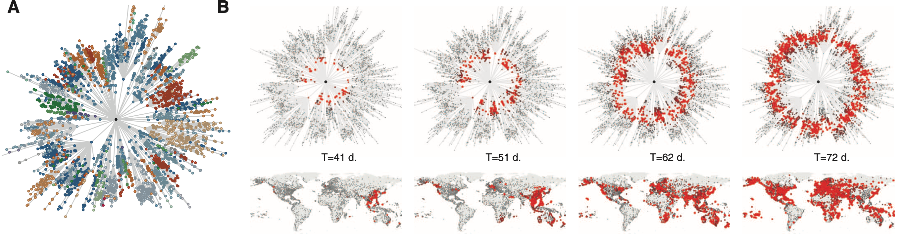
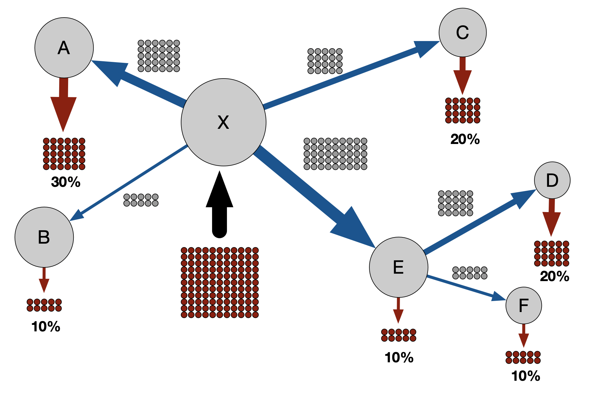
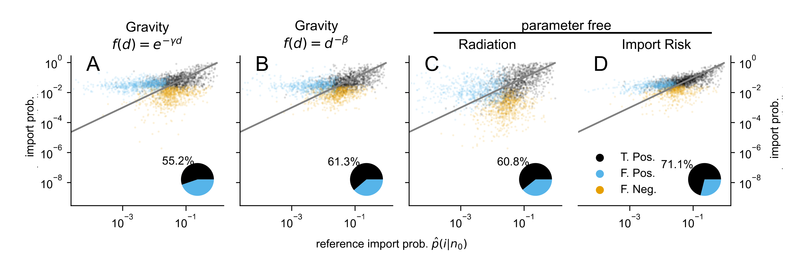

Our globalized world is strongly connected, on the small scale by buses, trains, cars, and on the largest, global scale by the Worldwide Air transportation Network (WAN).
It is likely that our connectivity has not reached its peak yet, since for example the number of globally scheduled air passengers increased yearly by about 6% between 2004 and 2019.
The connectivity has immense consequences on the propagation of disease since alongside passengers everything that sticks to them, such as bacteria, viruses, earth clumps beneath their shoes etc. comes with.

This project crosses the fields of network science, transportation, mobility and disease dynamics and it's an offspring of the idea to not use the conventional distance (in meter, miles, feet ... pick your unit) as a metric but an **effective distance** that is based on the mobility between regions.
When - $P(B | A)$ is the probability to travel to B from A (which is computed from mobility fluxes) than the effective distance is $ d _{\text{eff}} (A | B) = d_0 - log (P(i| n_0)) $ -.
In the seminal paper by [Brockmann and Helbing (2013)](https://www.science.org/doi/full/10.1126/science.1245200) \_effective distance $d _{\text{eff}}$ - was shown to linearly correlate with the arrival time of diseases as shown in Fig. 2.

 <figure>
  
  <figcaption>
  Fig. 2 - The shortest path tree based on the <b>effective distance</b> with the airport of Hong Kong as origin (<b>A</b>) and how a pandemic spreads around the globe (<b>B</b>).
  While the spread on the world map seems rather random, you see a nice circular wave spreading in the effective distance tree, illustrating the linear correlation to disease arrival times.
  Adapted from <a href="https://www.science.org/doi/full/10.1126/science.1245200">Brockmann and Helbing</a>.
</figcaption>
</figure>

In our recent paper [Klamser et al. (2024),](https://journals.plos.org/ploscompbiol/article?id=10.1371/journal.pcbi.1011775) we deepen the connection between the effective distance shortest path tree, spreading dynamics and mobility.
We present a way to estimate the passenger flow between any two airports (including those without direct connections) given that we only know the number and maximal capacity of planes (see illustrative example in Fig. 3).
In the end, the method allows us to estimate the number of infected passenger leaving B when we know the number of infected that entered A.
Thus, we know the risk of importation and why it is named <b>import risk method</b>.

 <figure>
  
  <figcaption>
  Fig. 3 - Import Risk Example: 100 infected passengers board planes at airport X en route to destination airports elsewhere in the network, going through transit airports in the process. The relative import risk at a given destination is the fraction of the 100 individuals that entered at airport X and exited at that destination airport (red).
  </figcaption>
</figure>

The mechanistic idea behind the import risk method is to let a random walker start at node B of the WAN and exit at each node with a probability derived from the effective distance shortest path tree.
The final fraction of times it leaves at node A is the import risk probability.
Now, this method is parameter free and motivated by disease dynamics, but at the same time it provides a method to estimate mobility on a global scale.
The mobility estimation is a classic task in transportation science with well-established models as the gravity model (proposed in [1946 by Zipf](https://www.jstor.org/stable/2087063?casa_token=5goDmVg4aOkAAAAA%3A6Y9zup7UcSjT8DQ1izhRza_-N568nGLP_43ikQys0Vzoux-4qaYKp1u0Cruz2YwZ2hggPU2PIKW4oqbB6xnFtaJIgj-oX_zCbMwLneoPv8OzCdsFXA)).
A core aspect of our import risk paper [Klamser et al. (2024)](https://journals.plos.org/ploscompbiol/article?id=10.1371/journal.pcbi.1011775) is to compare our method to established mobility models.
We found that our approach outperforms the established models, and the crazy thing is, that our method is parameter free, while the gravity model always needs parameter estimation (one needs to know the real mobility flow beforehand).
This holds true if we check the prediction quality for the 10 countries with the highest import probability, which is especially important for disease propagation since these countries are the one that should increase their passenger control (shown in Fig. 4).

 <figure>
  
  <figcaption>
  Fig. 4 - Mobility model comparisons for top 10 import countries: The well-established gravity model with exponential (<b>A</b>) and power-law (<b>B</b>) distance decay, the parameter free radiation model (<b>C</b>) and our import risk model (<b>D</b>).
  Each dot is a country that is among the 10 countries with the highest import probability from another country (10 target countries x 183 source countries).
  A true or false positive (T.Pos. or F. Pos.) means that the country is or is not among the 10 countries with the highest reference import probability.
  A false negative (F. Neg.) means that it belongs according to reference it is among the top 10 but was not detected by the respective model.
  Figure adapted from <a href="https://journals.plos.org/ploscompbiol/article?id=10.1371/journal.pcbi.1011775">Klamser et al. (2024)</a>.
  </figcaption>
</figure>

We applied the measure during COVID-19 to estimate the countries that have been reached by Omicron without it being detected [here](https://www.covid-19-mobility.org/reports/importrisk_omicron_update/).
And in a big cooperation with great colleagues that have been put together by [Manlio De Domenico,](https://manliodedomenico.com/) we have developed and validated a framework ([Klamser and d'Andrea et al. (2023)](https://academic.oup.com/pnasnexus/article/2/6/pgad192/7191545?login=false))that can estimate from sparse and noisy samples via phylogenetic analysis the time when the variant first occurred in the country of origin, how it spreads across the globe with our import risk model, and how the countries are affected by a disease dynamic model.
We were even able to smash everything into one number, which we call the **pandemic delay**, that estimates how long it takes for a new emerging variant to make out 10% of all current cases in a respective country.
It revealed that only by combining mobility data with a phylogenetic estimate of the reproduction number, the pandemic potentials of the lineages are correctly
assessed relative to each other.
